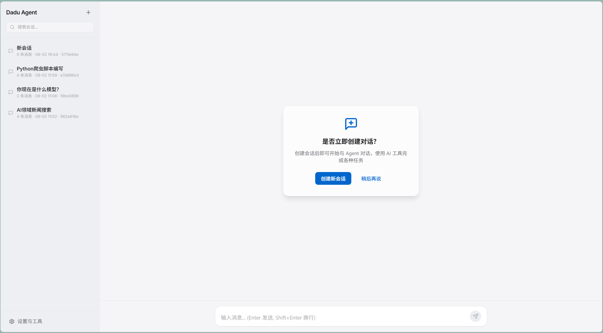
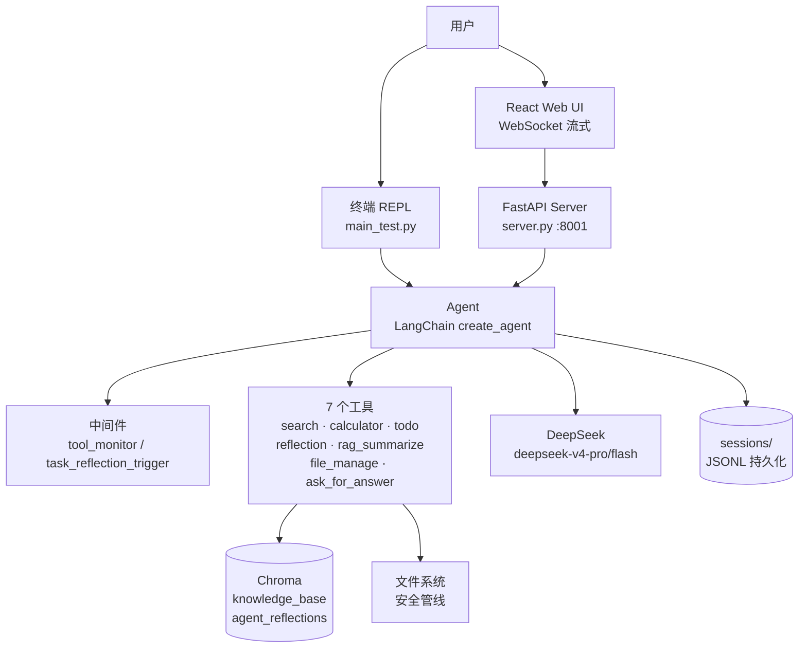
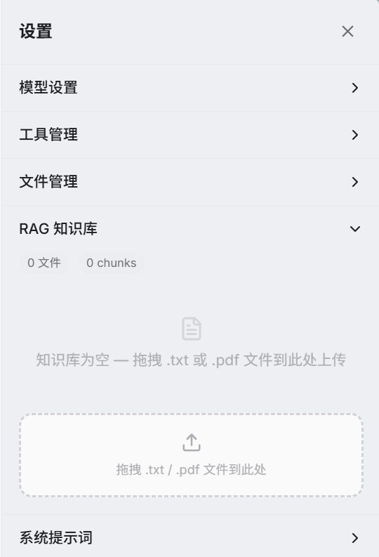

# Dadu Agent

**一个会反思、会追问、会动手的个性化 AI Agent 框架**

*A personalized AI agent framework that reflects, clarifies, and gets things done.*


Dadu Agent 是一个基于 **LangChain + LangGraph** 构建的全栈 AI 智能体项目：以 DeepSeek 为对话模型、Chroma 为向量库、DashScope 为嵌入模型，内置 **7 个工具、2 个中间件、完整的 RAG 管线和双模式文件管理安全体系**。它既可以在终端里作为会话式 REPL 使用，也附带一个 React 实时聊天界面——支持 WebSocket 流式输出、工具调用可视化和浏览器内的"Agent 向你提问"交互。

<details>
<summary>🇬🇧 English Introduction</summary>

Dadu Agent is a full-stack AI agent framework built on **LangChain + LangGraph**, powered by DeepSeek (chat), Chroma (vector store) and DashScope (embeddings). It ships with **7 tools, 2 middleware hooks, a complete RAG pipeline, and a dual-mode (manual/auto) file-management safety system**. Use it as a session-aware terminal REPL, or through the bundled React chat UI with WebSocket streaming, visualized tool calls, and in-browser "agent asks you" clarification dialogs. Highlights: a Chroma-backed reflection notebook with severity tagging and semantic search, a 95%-confidence clarification tool, LLM-based semantic text splitting with MD5 dedup, persistent sessions with auto-generated Chinese titles, and a settings panel with drag-and-drop knowledge-base upload. Python ≥ 3.13, managed with `uv`.

</details>

---

## 📸 界面预览



> 左侧会话列表支持搜索与多会话管理，一键创建新会话，即刻开始与 Agent 对话。

## ✨ 核心特色

### 🤖 开箱即用的 7 工具链

| 工具 | 能力 |
|---|---|
| `search` | Tavily 联网搜索，获取时效性与外部知识 |
| `calculator` | 基于 AST 白名单的安全数学求值（27 个内置函数，拒绝 `eval`） |
| `todo` | 任务规划器：拆解复杂任务、跟踪进度、支持会话级持久化 |
| `reflection` | 反思笔记本（见下文） |
| `rag_summarize` | 本地知识库检索 + 结构化摘要 |
| `file_manage` | 9 合 1 文件管理（读/写/追加/删/建目录/列/查/搜） |
| `ask_for_answer` | 主动向用户澄清疑问 |

系统提示词内置"场景—工具匹配表"与降级链（本地 RAG → 联网搜索），并强制来源标注（🔍 网络搜索 / 📚 本地知识库 / 🧮 计算推导），严禁在需要精确计算时心算。

### 🪞 会写"哲学理解"的反思笔记本

每次涉及工具调用的对话结束后，`@after_agent` 中间件会自动提醒 Agent 把经验写入反思笔记——即使任务顺利完成，也值得记录"这次为什么做对了"。每条反思包含**错误现象、解决方案、哲学理解**三个必填字段，支持 fatal/high/medium/low 严重度分级与标签，存入独立的 Chroma 集合，可被后续任务**语义检索**复用。Agent 由此拥有了可积累、可回查的长期记忆。

### ❓ 95% 置信度主动澄清

当 Agent 对需求的理解度不足 95% 时，会调用 `ask_for_answer` 一次一个精准提问（"你倾向于 A 方案还是 B 方案？"），而不是凭猜测硬答。在 Web 端，这个原本属于终端的确认流程被无缝桥接到浏览器——Agent 弹出提问框，用户点击回答，5 分钟无响应自动视为拒绝。

### 📁 双模式文件管理 + 多层安全管线

- **Manual 模式**：读操作自由，写/删/建目录必须经用户确认后携带 `--approved` 重试；
- **Auto 模式**：在安全边界内自由 CRUD，禁止删除目录、禁止触碰系统路径。

所有操作流经同一条安全管线：路径穿越阻断 → glob 黑名单（`.env`/`.git`/`Chromadb` 等）→ 写入扩展名白名单 → 1MB 读 / 5MB 写限额 → 目录深度限制，且全程留痕于独立日志。

### 📚 有性格的 RAG 知识库

拖拽 `.txt` / `.pdf` 到设置面板即可入库：先由 LLM 按语义边界切分（以 `|` 为界，绝不断在词语或从句中间），再递归细分、MD5 去重后写入 Chroma；大文件走懒加载批处理，不爆内存。检索摘要遵循固定四段式结构——**核心结论 → 关键信息点 → 矛盾与存疑 → 信息缺口**，并禁用"可能/大概/或许"等含糊词。用提示词原文的话说：

> 凡下断言，必溯其源；凡遇矛盾，必列双方；凡存缺口，必以明告。

### 💬 会话持久化与自动标题

每个会话以 JSONL 落盘，支持多会话创建/切换/删除；首轮对话后由模型自动生成 ≤20 字的中文标题（如"Python爬虫脚本编写"）。流式输出带历史清洗与失败回滚——上游模型报错时会自动恢复到最近一个可用快照，不产生半截对话。

### 🌐 Web 端实时交互

React 单页应用通过 WebSocket 接收逐字流式回复，工具调用以可展开的 chip 实时呈现（`rag_summarize 已执行`、`file_manage 已执行`…），Agent 回复完整渲染 Markdown 表格、代码块与流程图。

## 🎬 对话演示

<details>
<summary><b>点击查看完整对话示例</b> —— 编写豆瓣 Top250 爬虫，并连续两轮迭代增强（重试机制 → 冷却复活）</summary>

<br>


Agent 先查知识库与反思笔记，再调用 `file_manage` 写文件、读文件、改文件，多轮对话中持续迭代：从基础爬虫到三层重试架构，再到"连续失败 → 深度冷却 → 重建会话 → 重新挑战"的冷却复活机制。

</details>

## 🏗 架构总览



```
├── Agent.py                  # Agent 核心：工具装配、中间件、流式输出、会话持久化
├── main_test.py              # 终端 REPL 入口（多会话 + 斜杠命令）
├── server.py                 # FastAPI 入口（REST + WebSocket，端口 8001）
├── file_upload_service.py    # 知识库上传入口
├── agent_tools/              # 7 个工具 + 中间件 + 文件安全管线
├── api/                      # REST / WebSocket 路由
├── config/                   # YAML 配置（模型 / RAG / 文件管理 / 会话 / UI）
├── factory/                  # 模型工厂（抽象工厂，支持运行时切换模型）
├── frontend/                 # React 18 + TypeScript + Vite + Tailwind
├── prompt/                   # 系统 / RAG / 语义切分 / 报告 提示词
├── session/                  # 会话存储逻辑
├── tests/                    # 111 个 pytest 测试
├── tool/                     # 配置加载、日志（loguru）、路径、提示词加载
└── vector_uploader_service/  # RAG 摄取（LLM 切分 + MD5 去重）与检索摘要
```

## 🚀 快速开始

**前置要求**：Python ≥ 3.13、[`uv`](https://docs.astral.sh/uv/)、Node.js（仅 Web 前端需要）

```bash
# 1. 安装依赖
uv sync

# 2. 配置密钥：复制 .env.example 为 .env，填入三个 key
#    DEEPSEEK_API_KEY / TAVILY_API_KEY / DASHSCOPE_API_KEY
cp .env.example .env
```

**终端模式**：

```bash
uv run python main_test.py
# 支持 /sessions /switch <id> /new [名称] /info [id] /help 等命令
```

**Web 模式**：

```bash
# 构建前端（开发调试则用 npm run dev，Vite 端口 5173）
cd frontend && npm install && npm run build && cd ..

# 启动服务，访问 http://localhost:8001
uv run python server.py
```

**上传知识库**：在设置面板直接拖拽 `.txt` / `.pdf` 文件，或使用命令行：

```bash
uv run python file_upload_service.py
```

## ⚙ 配置

所有配置集中在 `config/` 目录的 YAML 文件中，且大部分可在 Web 设置面板中**热更新**：

| 配置文件 | 关键旋钮 |
|---|---|
| `AgentConfig.yml` | 对话模型（默认 `deepseek-v4-pro`） |
| `RagConfig.yml` | RAG 摘要模型、MD5 去重与上传记录路径 |
| `ChromaConfig.yml` | 嵌入模型（`text-embedding-v4`）、集合名、持久化目录、切分符 |
| `FileManageConfig.yml` | 文件管理模式（`manual` / `auto`）、黑名单、扩展名白名单、大小与深度限额 |
| `SessionConfig.yml` | 会话目录、自动保存、标题持久化 |
| `UIConfig.yml` | 主题（light/dark）、语言、侧栏宽度、字号 |
| `PromptConfig.yml` | 各提示词文件路径 |



> 设置面板：模型设置、工具管理、文件管理、系统提示词自定义；RAG 知识库支持拖拽上传 `.txt` / `.pdf`，自动分块索引。

## 🧪 测试

```bash
uv run pytest tests/ -v
```

**111 个测试**覆盖：文件安全管线（路径穿越/黑名单/限额/审批流）、会话序列化与持久化、流式输出的历史清洗与反思触发。

## 🛠 技术栈

| 层 | 技术 |
|---|---|
| Agent 框架 | LangChain 1.x · LangGraph |
| 模型 | DeepSeek（对话/摘要）· DashScope text-embedding-v4（嵌入） |
| 向量库 | Chroma（知识库 + 反思笔记双集合） |
| 后端 | FastAPI · Uvicorn · WebSocket |
| 前端 | React 18 · TypeScript · Vite 6 · Tailwind CSS |
| 工具链 | uv · pytest · loguru · Tavily |

## 🗺 路线图

- [ ] 报告生成能力（`report_prompt` 已预留）
- [ ] 前端国际化（`UIConfig` 已预留语言项）
- [ ] 接入更多模型供应商（模型工厂已支持运行时切换）
- [ ] 知识库支持更多文件格式（docx / markdown / 代码文件）
- [ ] 反思笔记的 Web 端可视化面板增强

---

<div align="center">
面对简单查询直击要害，面对复杂任务步步为营 —— 这，就是 Dadu Agent。
</div>
